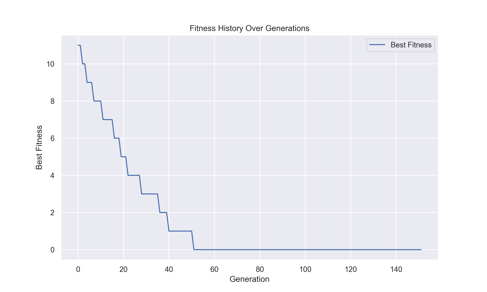

# 🧬 Simple Genetic Algorithm with Varying Lengths


This project implements a straightforward genetic algorithm (GA) that can evolve solutions of varying lengths, catering
specifically to scenarios where the solution size is not fixed.
Note that this implementation is more of an educational resource or a proof-of-concept framework rather than a
production-ready solution.

## Getting Started

To set up and run this project on your local machine, follow these steps:

1. Clone the repository and set up a virtual environment:

   ```bash
   virtualenv -p python3 venv
   source venv/bin/activate
    ```
2. Install the necessary dependencies:

   ```bash
   pip install -r requirements.txt
   ```
3. (Optional) Execute the example provided in solve_string_problem.py, which evolves from a random string towards a
   predefined target string:

   ```bash
   python solve_string_problem.py
    ```

## Adapting to Other Problems

The core component you need is `ga.py`. To tailor the genetic algorithm for different challenges, you should define
these problem-specific elements in a new script:

- Fitness Function: Determines how well an individual solution performs.
- Mutation Function: Alters individual solutions to introduce variability.
- Crossover Function: Combines two solutions to produce offspring.
- Initial Population Generation: Either a function to generate an initial population or a predefined list of initial
  individuals.


